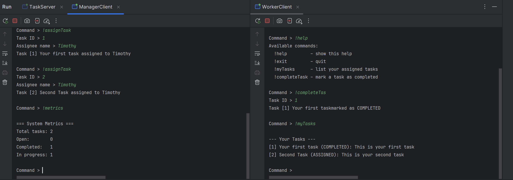
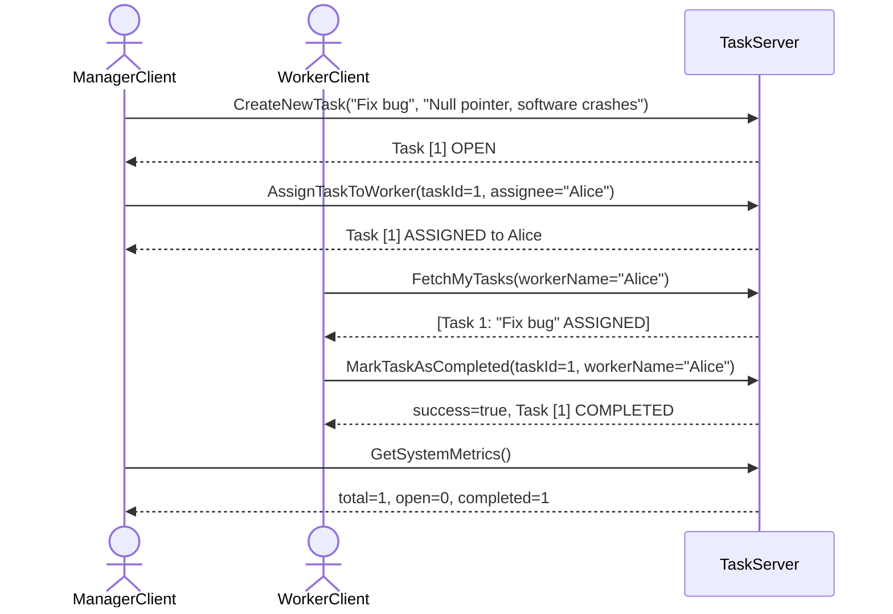
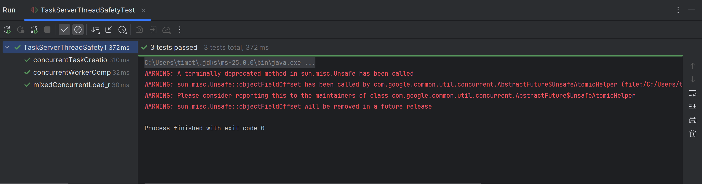
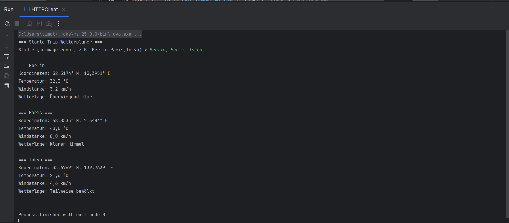
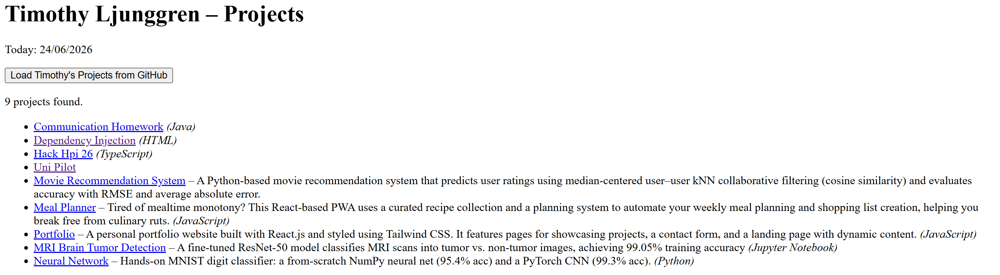

> Dieses Dokument wurde als PDF aus der `README.md` generiert. Für bessere Lesbarkeit befindet sie sich im Repository unter `README.md` oder auf [GitHub](https://github.com/timothy-ljunggren/communication-homework).
> Beachte dass für die Mermaid Diagramme möglicherweise Plugins installiert werden müssen

---

# Übung 02: Communication & The Web

**Name:** Timothy Ljunggren  
**Kurs:** Engineering verteilter Anwendungen, SS 2026 – TU Berlin

---

## 1. gRPC – Aufgabenverwaltung im Team

### 1.0 Anwendungsfall

Mein Programm implementiert eine teambasierte Aufgabenverwaltung. Der `TaskServer` dient als Austauschknoten zwischen zwei Arten von Clients:

- **ManagerClient** (Chef): Kann Aufgaben erstellen, Aufgaben an Teammitglieder zuweisen und System-Metriken abrufen.
- **WorkerClient** (Teammitglied): Kann eigene zugewiesene Aufgaben abrufen und als erledigt markieren.

Beide Clientarten teilen sich denselben Server und Aufgaben – sie sind also nicht unabhängig voneinander.

### Projektstruktur

```
ue2/
├── pom.xml
└── src/
    ├── main/
    │   ├── java/org/example/
    │   │   ├── Helper.java          Konsoleneingabe (readLine via BufferedReader)
    │   │   ├── TaskServer.java      gRPC-Server (ManagerService + WorkerService)
    │   │   ├── ManagerClient.java   Chef-Client (Aufgaben erstellen, zuweisen, Metriken)
    │   │   └── WorkerClient.java    Teammitglied-Client (Aufgaben abrufen, abhaken)
    │   └── proto/
    │       ├── task.proto           Gemeinsame Task-Message & TaskStatus-Enum
    │       ├── manager.proto        ManagerService (Chef-Operationen)
    │       └── worker.proto         WorkerService (Teammitglied-Operationen)
    └── test/
        └── java/org/example/
            └── TaskServerThreadSafetyTest.java   3 JUnit-Tests (Thread-Safety)
```

---

### 1.1 Proto-Dateien

Es wurden drei `.proto`-Dateien geschrieben, die die Kommunikation zwischen Server und den unterschiedlichen Clients definieren.

#### `task.proto` – gemeinsame Datentypen

```proto
syntax = "proto3";
package de.mcc;
option java_package = "de.mcc";

enum TaskStatus {
  OPEN = 0;
  ASSIGNED = 1;
  COMPLETED = 2;
}

message Task {
  uint32 task_id = 1;
  string title = 2;
  string description = 3;
  string assignee_name = 4;
  TaskStatus status = 5;
}
```

#### `manager.proto` – Dienst für den Chef-Client

```proto
syntax = "proto3";
package de.mcc;
import "task.proto";

message CreateTaskRequest { string title = 1; string description = 2; }
message CreateTaskResponse { Task created_task = 1; }

message AssignTaskRequest { uint32 task_id = 1; string assignee_name = 2; }
message AssignTaskResponse { Task updated_task = 1; bool success = 2; }

message GetMetricsRequest {}
message GetMetricsResponse {
  uint32 total_tasks = 1;
  uint32 open_tasks_count = 2;
  uint32 completed_tasks_count = 3;
}

service ManagerService {
  rpc CreateNewTask(CreateTaskRequest) returns (CreateTaskResponse) {}
  rpc AssignTaskToWorker(AssignTaskRequest) returns (AssignTaskResponse) {}
  rpc GetSystemMetrics(GetMetricsRequest) returns (GetMetricsResponse) {}
}
```

#### `worker.proto` – Dienst für den Teammitglied-Client

```proto
syntax = "proto3";
package de.mcc;
import "task.proto";

message GetMyTasksRequest { string worker_name = 1; }
message GetMyTasksResponse { repeated Task assigned_tasks = 1; }

message CompleteTaskRequest { uint32 taskId = 1; string worker_name = 2; }
message CompleteTaskResponse { bool success = 1; Task completed_task = 2; }

service WorkerService {
  rpc FetchMyTasks(GetMyTasksRequest) returns (GetMyTasksResponse) {}
  rpc MarkTaskAsCompleted(CompleteTaskRequest) returns (CompleteTaskResponse) {}
}
```

---

### 1.2 Implementierung

#### `TaskServer`

**Ausführung:** Die Main-Klasse in `org.example.TaskServer` starten. Der Server muss vor den Clients gestartet werden.

Der Server registriert beide Services auf Port `9090` und startet den Server:

```java
Server server = Grpc
        .newServerBuilderForPort(9090, InsecureServerCredentials.create())
        .addService(new ManagerServiceImpl())
        .addService(new WorkerServiceImpl())
        .build();
server.start();
server.awaitTermination();
```

#### `ManagerClient`

**Ausführung:** Die Main-Klasse in `org.example.ManagerClient` starten (separates Terminal, Server muss auch laufen)

Interaktive Konsolenschleife mit `!`-Befehlen:

| Befehl | Beschreibung |
|---|---|
| `!createTask` | Neuen Task anlegen (fragt nach Title + Description) |
| `!assignTask` | Task an Teammitglied zuweisen (fragt Task-ID + Name) |
| `!metrics` | Zeigt Anzahl an offenen, erledigten und in progress Tasks an |
| `!help` / `!exit` | Hilfe / Beenden |

#### `WorkerClient`

**Ausführung:** Die Main-Klasse in `org.example.WorkerClient` starten (separates Terminal, Server muss laufen).

Beim Start fragt der Client nach dem Namen des Teammitglieds. Anschließend stehen zwei Befehle zur Verfügung:

| Befehl | Beschreibung |
|---|---|
| `!myTasks` | Alle zugewiesenen Tasks des eingeloggten Workers anzeigen |
| `!completeTask` | Task als erledigt markieren (fragt nach Task-ID) |



---

### 1.3 Interne Datenhaltung & Abhängigkeit der Clients

Der Server hält alle Tasks in einer gemeinsamen `List<Task>`, auf die beide Services zugreifen. Tasks werden vom `ManagerClient` erstellt und zugewiesen; der `WorkerClient` liest und bearbeitet denselben Bestand. Die Clients sind damit **nicht** unabhängig voneinander.

```java
// TaskServer.java – gemeinsamer Zustand
private static final List<Task> tasks = new ArrayList<>();
private static final AtomicInteger idCounter = new AtomicInteger(1);
```

`AtomicInteger` stellt sicher, dass Task-IDs immer eindeutig und ohne Race Condition vergeben werden.

#### Ablauf einer typischen Interaktion



---

### 1.4 Thread-Safety

Thread-Safety wird durch `synchronized (tasks)`-Blöcke in jedem RPC-Handler erreicht. Alle Lese- und Schreibzugriffe auf die gemeinsame `tasks`-Liste werden über dasselbe Monitor-Objekt synchronisiert:

```java
// Beispiel: createNewTask – Schreibzugriff
@Override
public void createNewTask(Manager.CreateTaskRequest request,
                          StreamObserver<Manager.CreateTaskResponse> responseObserver) {
    synchronized (tasks) {
        Task newTask = Task.newBuilder()
                .setTaskId(idCounter.getAndIncrement())
                .setTitle(request.getTitle())
                .setDescription(request.getDescription())
                .setStatus(TaskStatus.OPEN)
                .build();
        tasks.add(newTask);
        // ...
    }
}
```

```java
// Beispiel: fetchMyTasks – Lesezugriff ebenfalls synchronisiert
@Override
public void fetchMyTasks(Worker.GetMyTasksRequest request,
                         StreamObserver<Worker.GetMyTasksResponse> responseObserver) {
    synchronized (tasks) {
        List<Task> mine = tasks.stream()
                .filter(t -> t.getAssigneeName().equalsIgnoreCase(request.getWorkerName()))
                .toList();
        // ...
    }
}
```

#### JUnit-Tests

Die Datei `TaskServerThreadSafetyTest.java` enthält drei Tests, die über gRPCs **In-Process-Transport** (kein echter Netzwerk-Port) laufen:

| Test | Beschreibung |
|---|---|
| `concurrentTaskCreation_producesCorrectTotalAndUniqueIds` | 4 Manager-Threads erstellen je 10 Tasks gleichzeitig. Anschließend muss die Gesamtzahl exakt 40 betragen |
| `concurrentWorkerCompletion_metricsRemainConsistent` | 40 Tasks werden seriell erstellt und auf 4 Worker verteilt. Dann markieren alle 4 Worker-Threads gleichzeitig ihre Tasks. Danach muss `completed == total` gelten. |
| `mixedConcurrentLoad_noDeadlockOrException` | Manager-Threads schreiben, Worker-Threads lesen gleichzeitig. Es darf kein Deadlock entstehen |

```
3 tests passed
```



---

## 2. Web APIs – Wetterplaner

### 2.1 Anwendungsfall

**Ausführung:** Die Main-Klasse in `org.example.HTTPClient` starten

Der Nutzer gibt eine kommagetrennte Liste von Städten ein. Das Programm ermittelt für jede Stadt zunächst die geografischen Koordinaten (Längen- und Breitengrad) und ruft anschließend die aktuellen Wetterdaten ab. Am Ende wird eine Wetterübersicht für alle Städte ausgegeben.

**Verwendete APIs (keine API-Schlüssel notwendig):**

| API | Zweck |
|---|---|
| [Nominatim (OpenStreetMap)](https://nominatim.org/release-docs/latest/api/Overview/) | Stadtname -> Koordinaten (Geocoding) |
| [Open-Meteo](https://open-meteo.com/) | Koordinaten -> Wetterdaten |

---

### 2.2 Anforderungserfüllung

#### Anforderung 1 – Mindestens zwei unterschiedliche Web-APIs

Das Programm ruft **Nominatim** (Geocoding) und **Open-Meteo** (Wetter) auf – zwei vollständig unabhängige APIs.

#### Anforderung 2 – Mindestens eine API wird mehrfach aufgerufen (1P)

Beide APIs werden **für jede eingegebene Stadt erneut aufgerufen** (Schleife über `cities`). Bei Eingabe von z. B. `Berlin,Paris,Tokyo` wird Nominatim dreimal und Open-Meteo dreimal aufgerufen.

```java
for (String city : cities) {
    // API-Aufruf 1: Nominatim (für jede Stadt)
    HttpRequest geoRequest = HttpRequest.newBuilder()
            .uri(URI.create(NOMINATIM_URL + encodedCity))
            .GET()
            .build();
    
    HttpResponse<String> geoResponse = client.send(geoRequest, ...);
    
    // ...

    // API-Aufruf 2: Open-Meteo (für jede Stadt)
    String weatherUrl = String.format(OPEN_METEO_URL, lat, lon);
    HttpRequest weatherRequest = HttpRequest.newBuilder()
            .uri(URI.create(weatherUrl))
            .GET()
            .build();
    HttpResponse<String> weatherResponse = client.send(weatherRequest, HttpResponse.BodyHandlers.ofString());
}
```

#### Anforderung 3 – Parameter dürfen nicht statisch sein (2P)

Die Städtenamen werden zur Laufzeit per Konsoleneingabe eingelesen. Bei jeder Ausführung können andere Städte angegeben werden:

```java
String input = Helper.readLine("Städte (kommagetrennt, z.B. Berlin,Paris,Tokyo)");
String[] cities = input.split(",");
```

#### Anforderung 4 – Antworten auslesen und weiterverarbeiten (2P)

Der Output von **Nominatim** (Koordinaten) wird direkt als Input für **Open-Meteo** verwendet. Das Programm ist somit eine Pipeline.

```java
// Schritt 1: Nominatim-Antwort parsen
JsonArray geoArray = JsonParser.parseString(geoResponse.body()).getAsJsonArray();
// ...
JsonObject geoObj  = geoArray.get(0).getAsJsonObject();
double lat = geoObj.get("lat").getAsDouble();   // Koordinaten aus API 1
double lon = geoObj.get("lon").getAsDouble();

// ...

// Schritt 2: Koordinaten als Parameter für Open-Meteo verwenden
String weatherUrl = String.format(OPEN_METEO_URL, lat, lon);  // Input für API 2
```

Die Wetterdaten werden anschließend weiterverarbeitet: Der numerische `weathercode` wird über `describeWeatherCode()` in einen lesbaren deutschen Text übersetzt:

```java
JsonObject cw = weatherRoot.getAsJsonObject("current_weather");
double temperature = cw.get("temperature").getAsDouble();
double windspeed = cw.get("windspeed").getAsDouble();
int weathercode = cw.get("weathercode").getAsInt();

System.out.printf("Temperatur: %.1f °C%n", temperature);
System.out.printf("Windstärke: %.1f km/h%n", windspeed);
System.out.printf("Wetterlage: %s%n", describeWeatherCode(weathercode));
```

### 2.3 Beispielausgabe



---

## 3. TU User Pages

Die Webseite ist erreichbar unter: [Timothy Ljunggren – Projects](https://www.user.tu-berlin.de/timothy-ljunggren/)

Die Seite enthält valides HTML und nutzt JavaScript für interaktive Funktionalität.



---

*Timothy Ljunggren · Engineering verteilter Anwendungen SS 2026 · Übung 02*
